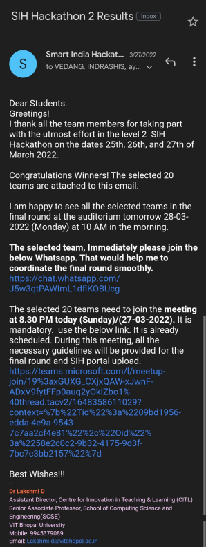

# **Smart India Hackathon-2022 [SIH'22]**

> Objective 

Smart Education

> Overview

**As we know in our education system for newly graduated student, they are hard to find job openings at any big tech company because of multiple resources present over on the internet and they are stuck where they keep their eyes open and when these openings have come. so, our team "NEXT-TECH" decide to make a web application by which any student who is in college they got to know about any tach related opening at any MNCs with a suitable role according to their skills set they have. Meanwhile, they can also find job openings according to salary range in the different tech domains.**

> Result

**RunnerUp @SIH'22 at University Level**

> Please See Attached Screenshot Below

